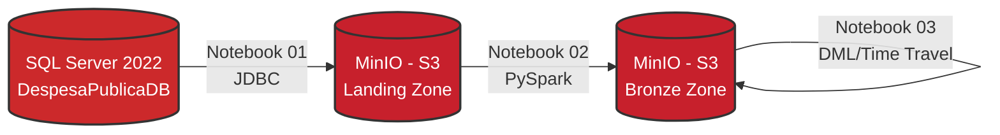

# Pipeline de Dados: Apache Spark + Delta Lake + MinIO + SQL Server

[](https://www.python.org/downloads/)
[](https://github.com/astral-sh/uv)
[](https://spark.apache.org/)
[](https://delta.io/)
[](https://min.io/)
[](https://www.microsoft.com/sql-server)

Projeto desenvolvido para o curso de **Engenharia de Dados com Spark e Delta Lake**. 
Implementa um pipeline completo de dados com o tema de **Administração - Despesa Pública Federal**, inspirado nos dados abertos do [Portal de Dados Abertos do Governo Federal](https://dados.gov.br/dados/conjuntos-dados/administracao---despesa-publica---empenhos).

---

## Arquitetura do Pipeline



> **Nota sobre Conectividade (Sem ODBC):** Toda a comunicação com o SQL Server é realizada via **JDBC** pelo PySpark. O driver JDBC é baixado e injetado automaticamente pelo Spark via Maven Central em tempo de execução. Nenhuma instalação de driver nativo no sistema operacional host é necessária.

---

## Dataset: DespesaPublicaDB

Banco relacional composto por **11 tabelas** que modelam o ciclo completo de execução orçamentária federal:

| Tabela | Descrição | Registros |
|--------|-----------|:---------:|
| `orgao` | Órgãos federais (MEC, MS, MJSP, MCTI, MMA) | 5 |
| `unidade` | Unidades gestoras vinculadas aos órgãos | 11 |
| `programa` | Programas de governo | 8 |
| `acao` | Ações orçamentárias | 12 |
| `fonte_recurso` | Fontes de financiamento | 6 |
| `credor` | Fornecedores/credores do governo | 15 |
| `empenho` | Comprometimento de despesa | 50 |
| `item_empenho` | Itens detalhados de cada empenho | 126 |
| `liquidacao` | Liquidações de despesa | 40 |
| `pagamento` | Pagamentos realizados | 35 |
| `historico_preco` | Histórico de preços de referência | 15 |

---

## Pré-requisitos

| Ferramenta | Versão Mínima |
|------------|--------------|
| Docker + Docker Compose v2 | Mais recente |
| Python | 3.11 |
| Java JDK | 11 |
| UV (Gerenciador de pacotes) | Mais recente |
| Git | Mais recente |

---

## Instalação por Sistema Operacional

### Arch Linux / Manjaro

**1. Java 11**
```bash
sudo pacman -S jdk11-openjdk
sudo archlinux-java set java-11-openjdk

echo 'export JAVA_HOME=/usr/lib/jvm/java-11-openjdk' >> ~/.bashrc
echo 'export PATH=$JAVA_HOME/bin:$PATH' >> ~/.bashrc
source ~/.bashrc
```

**2. Python 3.11**
```bash
sudo pacman -S pyenv
pyenv install 3.11.9
pyenv global 3.11.9
```

**3. Docker**
```bash
sudo pacman -S docker docker-compose
sudo systemctl enable --now docker
sudo usermod -aG docker $USER
newgrp docker
```

---

### Ubuntu / Debian (Recomendado para WSL)

**1. Atualizar e instalar dependências base**
```bash
sudo apt update && sudo apt upgrade -y
sudo apt install -y git curl
```

**2. Java 11**
```bash
sudo apt install -y openjdk-11-jdk

echo 'export JAVA_HOME=/usr/lib/jvm/java-11-openjdk-amd64' >> ~/.bashrc
echo 'export PATH=$JAVA_HOME/bin:$PATH' >> ~/.bashrc
source ~/.bashrc
```

**3. Python 3.11 via Pyenv**
```bash
sudo apt install -y make build-essential libssl-dev zlib1g-dev \
libbz2-dev libreadline-dev libsqlite3-dev wget curl llvm \
libncursesw5-dev xz-utils tk-dev libffi-dev liblzma-dev

curl [https://pyenv.run](https://pyenv.run) | bash

echo 'export PYENV_ROOT="$HOME/.pyenv"' >> ~/.bashrc
echo 'command -v pyenv >/dev/null || export PATH="$PYENV_ROOT/bin:$PATH"' >> ~/.bashrc
echo 'eval "$(pyenv init -)"' >> ~/.bashrc
source ~/.bashrc

pyenv install 3.11.9
pyenv global 3.11.9
```

**4. Gerenciador UV**
```bash
curl -LsSf [https://astral.sh/uv/install.sh](https://astral.sh/uv/install.sh) | sh
source ~/.bashrc
```

**5. Docker**
```bash
sudo apt install -y ca-certificates curl
sudo install -m 0755 -d /etc/apt/keyrings
sudo curl -fsSL [https://download.docker.com/linux/ubuntu/gpg](https://download.docker.com/linux/ubuntu/gpg) -o /etc/apt/keyrings/docker.asc
sudo chmod a+r /etc/apt/keyrings/docker.asc

echo "deb [arch=$(dpkg --print-architecture) signed-by=/etc/apt/keyrings/docker.asc] [https://download.docker.com/linux/ubuntu](https://download.docker.com/linux/ubuntu) $(. /etc/os-release && echo "$VERSION_CODENAME") stable" | sudo tee /etc/apt/sources.list.d/docker.list > /dev/null

sudo apt update
sudo apt install -y docker-ce docker-ce-cli containerd.io docker-compose-plugin

sudo usermod -aG docker $USER
newgrp docker
```

---

## Configuração do Projeto

### 1. Clonar o repositório
```bash
git clone [https://github.com/brunotesckemartins/spark-delta-minio-despesa.git](https://github.com/brunotesckemartins/spark-delta-minio-despesa.git)
cd spark-delta-minio-despesa
```

### 2. Variáveis de Ambiente
Crie o arquivo de configuração local copiando o template padrão fornecido no repositório:
```bash
cp .env.example .env
```
*Edite o arquivo `.env` caso precise alterar portas ou credenciais padrão.*

### 3. Inicializar a Infraestrutura (Containers)
```bash
docker compose up -d
```

| Container | Imagem | Portas Expostas |
|-----------|--------|--------|
| `sqlserver-despesa` | `mcr.microsoft.com/mssql/server:2022-latest` | `1433` |
| `minio-despesa` | `minio/minio` (Feb 2025) | `9020` (API), `9021` (Console) |

### 4. Ambiente Virtual e Dependências (Python)
```bash
uv venv
source .venv/bin/activate
uv sync
```

### 5. Documentação Técnica Local (MkDocs)
O projeto conta com uma documentação detalhada sobre as decisões arquiteturais e funcionamento dos notebooks. Para acessá-la localmente:
```bash
uv pip install mkdocs mkdocs-material
mkdocs serve
```
Acesse o portal de documentação em: [http://127.0.0.1:8000](http://127.0.0.1:8000).

---

## Execução do Pipeline

Os scripts de processamento estão estruturados em Jupyter Notebooks na pasta `notebook/`. Eles devem ser executados na seguinte ordem lógica:

| Ordem | Notebook | Função Principal |
|:---:|----------|-----------|
| **00** | `00_setup_sqlserver.ipynb` | Criação do banco, estruturação das tabelas e carga inicial (Insert/JDBC). |
| **01** | `01_sqlserver_to_minio_csv.ipynb` | Extração dos dados do SQL Server e salvamento em formato CSV no MinIO (Landing Zone). |
| **02** | `02_csv_to_delta.ipynb` | Refinamento: Conversão dos arquivos CSV para o formato Delta Lake (Bronze Zone). |
| **03** | `03_dml_delta.ipynb` | Execução de operações transacionais (DML), verificação de History e validação do Time Travel no Delta Lake. |

---

## Acessos e Credenciais Padrão

Caso não tenha alterado o arquivo `.env`, utilize as credenciais abaixo para acessar os serviços:

### MinIO (Object Storage)
* **URL Console:** [http://localhost:9021](http://localhost:9021)
* **Usuário:** `minioadmin`
* **Senha:** `minioadmin`

### SQL Server (Banco Relacional)
* **Usuário:** `sa`
* **Senha:** `SqlServer@2024!`

---

## Conceitos Arquiteturais Adotados

### Tabelas Gerenciadas vs Não Gerenciadas
Este projeto implementa exclusivamente **Tabelas Não Gerenciadas** (Unmanaged Tables) no Lakehouse:
* **Armazenamento de Dados:** Os arquivos físicos (Parquet/Logs) residem diretamente no Object Storage, dentro do MinIO (`s3a://bronze/`).
* **Metadados:** São gerenciados pelo Spark Catalog em tempo de execução.
* **Segurança na Exclusão:** Executar um comando `DROP TABLE` remove apenas o registro do catálogo lógico. Os arquivos físicos permanecem intactos e seguros no MinIO.

---

## Encerramento do Ambiente

Para parar os serviços e remover os containers, preservando as configurações:
```bash
docker compose down
```

Para remover também os volumes (excluindo os bancos de dados criados e os buckets do MinIO):
```bash
docker compose down -v
```
