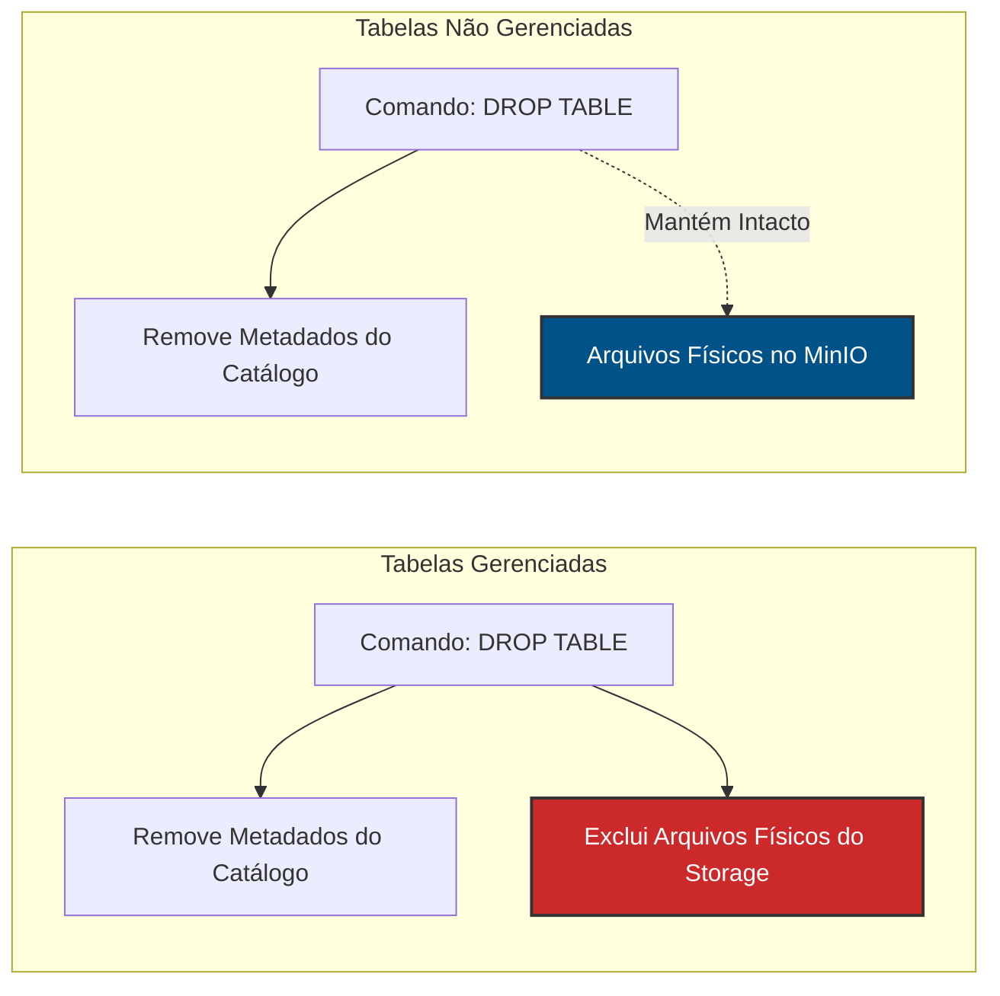

# Tabelas Gerenciadas vs. Não Gerenciadas no Lakehouse

Ao estruturar o armazenamento no Apache Spark (utilizando o Spark Catalog ou Hive Metastore) e salvar DataFrames através de instruções DDL como `CREATE TABLE`, estabelecemos o nível de controle lógico e físico que o motor de processamento terá sobre o ciclo de vida dos dados. 

Compreender essa diferença é fundamental para a governança e segurança do nosso Lakehouse.

---

## 📊 Fluxo de Exclusão (Arquitetura Visual)

O diagrama abaixo ilustra o comportamento do motor do Spark ao receber um comando de exclusão (`DROP TABLE`) para ambos os tipos de tabela:

---

## 📋 Quadro Comparativo

| Característica | Tabela Não Gerenciada (Externa) | Tabela Gerenciada (Interna) |
| :--- | :--- | :--- |
| **Definição de Local** | Explícita pelo desenvolvedor via `LOCATION` | Automática no diretório padrão (`spark-warehouse/`) |
| **Responsabilidade do Spark** | Gerencia estritamente os metadados | Gerencia metadados e arquivos físicos |
| **Impacto do `DROP TABLE`** | Remove catálogo lógico. **Dados físicos são mantidos.** | Remove catálogo lógico. **Dados físicos são excluídos.** |
| **Uso no Projeto SED** | Abordagem padrão (Landing/Bronze Zone no MinIO) | Evitada por risco operacional e falta de isolamento |

---

## Tabelas Não Gerenciadas (Unmanaged / External Tables)

Esta é a abordagem arquitetural **adotada ativamente** neste projeto para o tráfego de dados no MinIO.

* **Conceito:** O Engenheiro de Dados define explicitamente o diretório onde os arquivos físicos serão persistidos, utilizando a cláusula `LOCATION` (exemplo: `LOCATION 's3a://bronze/empenho'`).
* **Comportamento:** O Spark administra apenas os metadados (esquema, particionamento, nome da tabela) no catálogo lógico. O armazenamento físico é considerado externo à responsabilidade exclusiva da engine.

!!! success "Segurança Arquitetural no Projeto"
    Utilizamos tabelas não gerenciadas para garantir a proteção dos dados abertos de Despesa Pública. Caso um analista ou um script defeituoso execute um `DROP TABLE` acidental, o impacto é nulo na camada física. Basta recriar o metadado apontando para o mesmo `LOCATION` e a tabela estará restaurada instantaneamente, sem necessidade de reprocessamento.

---

## Tabelas Gerenciadas (Managed Tables)

Esta é a abordagem padrão do Spark quando um DataFrame é salvo como tabela sem a especificação de um caminho externo.

* **Conceito:** O Spark assume a responsabilidade completa sobre o ecossistema.
* **Comportamento:** Existe um forte acoplamento (tight coupling). A vida útil do dado físico está estritamente atrelada à vida útil da entidade lógica no banco de dados.

!!! warning "Por que evitamos esta abordagem?"
    Em um pipeline corporativo que lida com histórico financeiro (empenhos, liquidações e pagamentos), o acoplamento rígido de tabelas gerenciadas representa um risco crítico. A exclusão de uma tabela gerenciada resultaria na perda irrecuperável do histórico processado, exigindo a reexecução completa da extração JDBC na origem (SQL Server).
