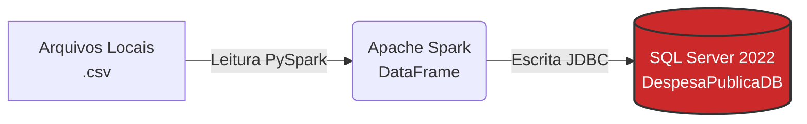
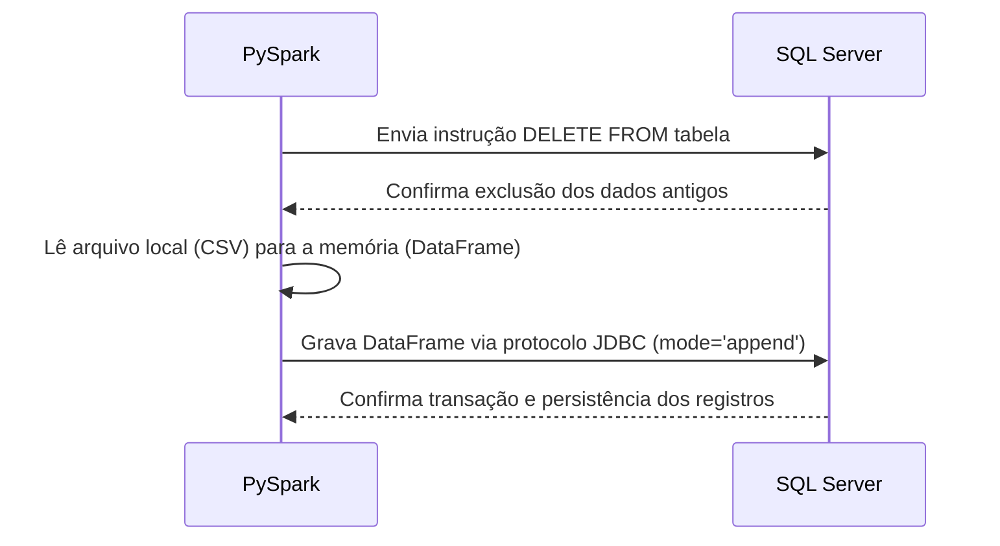

# 00 - Setup e Carga Inicial do SQL Server

Nesta etapa primária, construímos a fundação de todo o pipeline de dados. Este notebook tem como objetivo simular o ambiente transacional (OLTP) de origem, criando o banco de dados `DespesaPublicaDB`, estruturando suas 11 tabelas e realizando a carga dos dados base.

---

## Arquitetura da Carga Inicial

O diagrama abaixo ilustra como o Spark atua como motor de ingestão para popular o banco relacional a partir de nossa base local de arquivos:



---

## Inicialização do Spark com Injeção de Dependência JDBC

Para que o Apache Spark consiga se comunicar nativamente com o SQL Server, é necessário carregar o driver JDBC oficial da Microsoft na máquina virtual Java (JVM) do Spark.

!!! info "Gerenciamento de Drivers via Maven"
    Ao invés de baixar e configurar o driver JDBC manualmente no nível do sistema operacional, utilizamos a configuração `spark.jars.packages`. Isso instrui o Spark a baixar o artefato `.jar` diretamente do repositório Maven Central no momento da inicialização, garantindo portabilidade total do código entre diferentes ambientes.

**Script de Inicialização da Sessão:**
```python
from pyspark.sql import SparkSession

spark = (
    SparkSession.builder
    .appName('DespesaPublica-Setup')
    .config(
        'spark.jars.packages',
        'com.microsoft.sqlserver:mssql-jdbc:12.4.2.jre11'
    )
    .getOrCreate()
)
```

---

## Orquestração da Carga (CSV para SQL Server)

A inserção dos dados foi projetada para ser **idempotente**. Isso significa que podemos executar o notebook múltiplas vezes sem o risco de duplicar os registros no banco de dados.

### Fluxo Lógico de Execução



**Script de Ingestão:**
```python
for tabela in TABELAS:
    # 1. Limpeza prévia para garantir idempotência da carga
    sqlcmd(f'DELETE FROM {tabela}', db=DATABASE)

    # 2. Leitura do arquivo estático local
    df = (
        spark.read
        .option('header', 'true')
        .option('inferSchema', 'true')
        .csv(f'{DATA_DIR}/{tabela}.csv')
    )

    # 3. Escrita no banco de dados transacional
    df.write.jdbc(
        url=JDBC_DB,
        table=tabela,
        mode='append',
        properties=JDBC_PROPS
    )
    
    print(f"Carga da tabela '{tabela}' processada com sucesso.")
```
