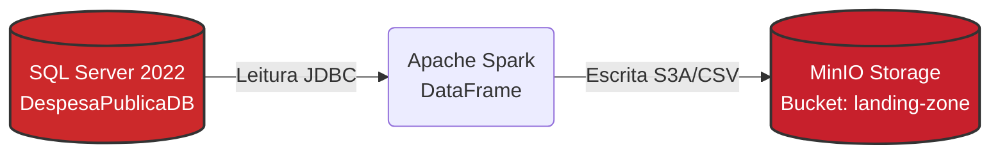

# 01 - Extração e Ingestão para a Landing Zone (MinIO)

Esta etapa representa a fase de ingestão bruta (Raw Data) do nosso pipeline. O objetivo é extrair os dados do banco relacional de origem (SQL Server) e persistí-los de forma imutável no armazenamento em nuvem, especificamente no bucket `landing-zone` do MinIO.

---

## Arquitetura de Ingestão

O diagrama abaixo detalha o tráfego de dados. O Apache Spark atua como o motor de orquestração, extraindo as informações via protocolo JDBC e escrevendo os arquivos brutos via API S3:



---

## Configuração do Spark para S3/MinIO

Nesta etapa, o PySpark necessita não apenas do driver do SQL Server, mas também das bibliotecas do ecossistema Hadoop-AWS para habilitar a comunicação com o MinIO, que é 100% compatível com a API do Amazon S3.

!!! info "Acesso no Estilo de Caminho (Path Style Access)"
    A configuração `spark.hadoop.fs.s3a.path.style.access` definida como `true` é crucial para o funcionamento do MinIO. Diferente da AWS, que utiliza URLs baseadas em subdomínios (ex: `bucket.s3.amazonaws.com`), as instâncias locais do MinIO operam com a estrutura de caminhos diretamente na URL (ex: `localhost:9020/bucket`).

**Script de Inicialização da Sessão:**
```python
from pyspark.sql import SparkSession

spark = (
    SparkSession.builder
    .appName('DespesaPublica-01-SQLServer-to-MinIO')
    .config(
        'spark.jars.packages',
        'com.microsoft.sqlserver:mssql-jdbc:12.4.2.jre11,'
        'org.apache.hadoop:hadoop-aws:3.3.4,'
        'com.amazonaws:aws-java-sdk-bundle:1.12.367'
    )
    .config('spark.hadoop.fs.s3a.endpoint',         MINIO_ENDPOINT)
    .config('spark.hadoop.fs.s3a.access.key',       MINIO_ACCESS_KEY)
    .config('spark.hadoop.fs.s3a.secret.key',       MINIO_SECRET_KEY)
    .config('spark.hadoop.fs.s3a.path.style.access', 'true')
    .config('spark.hadoop.fs.s3a.impl', 'org.apache.hadoop.fs.s3a.S3AFileSystem')
    .getOrCreate()
)
```

---

## Extração de Dados (Full Load)

O processo iterativo conecta no banco de dados, extrai o conteúdo integral de cada tabela listada e o salva no MinIO no formato CSV.

!!! warning "Governança e o uso do Coalesce"
    Utilizamos a função `.coalesce(1)` estrategicamente nesta fase. O Spark, por ser distribuído nativamente, tende a salvar os resultados em múltiplas partições (vários pequenos arquivos CSV). Para a *Landing Zone*, onde buscamos uma cópia exata 1:1 da tabela de origem para facilitar a governança, forçamos a consolidação dos dados em um único arquivo de saída. Cabe ressaltar que isso pode causar gargalos de performance em cenários de Big Data massivo, mas atende perfeitamente ao escopo transacional deste projeto.

**Script de Extração e Persistência:**
```python
for tabela in TABELAS:
    # 1. Leitura integral da origem via JDBC
    df = spark.read.jdbc(
        url=JDBC_URL, 
        table=tabela, 
        properties=JDBC_PROPS
    )

    # 2. Definição do caminho de destino no padrão S3A
    csv_path = f's3a://{BUCKET_LANDING}/{tabela}'
    
    # 3. Gravação forçada em arquivo único no MinIO
    (
        df.coalesce(1)
        .write
        .mode('overwrite')
        .option('header', 'true')
        .csv(csv_path)
    )
    
    print(f"Tabela '{tabela}' extraída e salva com sucesso na Landing Zone.")
```
