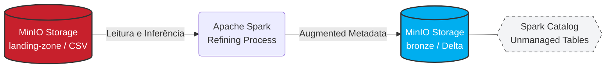

# 02 - Refinamento para a Camada Bronze (Delta Lake)

Nesta etapa, realizamos a transição dos dados da **Landing Zone** (onde os arquivos estão em estado bruto e sem tipagem rigorosa) para a **Bronze Zone**. O principal objetivo é converter os arquivos CSV legados para o formato **Delta Lake**, um formato colunar de alto desempenho que habilita transações ACID e viagens no tempo.

---

## Arquitetura de Refinamento e Tipagem

O fluxo abaixo descreve a leitura dos dados brutos no MinIO, a aplicação de metadados de auditoria e a persistência final como tabelas Delta registradas no catálogo:



---

## Spark Session Integrada ao Delta e S3

Para esta etapa, utilizamos o utilitário `configure_spark_with_delta_pip`. Esta abordagem é preferível em ambientes de produção pois garante que as versões do JAR do Delta e da biblioteca Python estejam sincronizadas, além de permitir a injeção de pacotes extras para conectividade S3A.

!!! info "Isolamento de Dependências"
    A configuração `spark.sql.extensions` e o uso do `DeltaCatalog` são obrigatórios para habilitar as funcionalidades avançadas do Delta Lake, como o `MERGE INTO` e o `VACUUM`. Sem essas extensões, o Spark trataria os arquivos apenas como Parquet comum, perdendo as garantias de integridade do log de transações.

**Script de Inicialização Técnica:**
```python
from pyspark.sql import SparkSession
from delta import configure_spark_with_delta_pip

EXTRA_PACKAGES = [
    "org.apache.hadoop:hadoop-aws:3.3.4",
    "com.amazonaws:aws-java-sdk-bundle:1.12.367"
]

builder = (
    SparkSession.builder
    .appName('DespesaPublica-02-CSV-to-Delta')
    .config('spark.sql.extensions', 
            'io.delta.sql.DeltaSparkSessionExtension')
    .config('spark.sql.catalog.spark_catalog', 
            'org.apache.spark.sql.delta.catalog.DeltaCatalog')
    .config('spark.hadoop.fs.s3a.endpoint',         MINIO_ENDPOINT)
    .config('spark.hadoop.fs.s3a.access.key',       MINIO_ACCESS_KEY)
    .config('spark.hadoop.fs.s3a.secret.key',       MINIO_SECRET_KEY)
    .config('spark.hadoop.fs.s3a.path.style.access', 'true')
    .config('spark.hadoop.fs.s3a.impl', 
            'org.apache.hadoop.fs.s3a.S3AFileSystem')
)

spark = configure_spark_with_delta_pip(builder, extra_packages=EXTRA_PACKAGES).getOrCreate()
```

---

## Enriquecimento de Metadados e Registro no Catálogo

Durante a conversão de CSV para Delta, aplicamos uma estratégia de **Metadata Augmentation** (Aumento de Metadados). Adicionamos colunas que facilitam a linhagem de dados e a depuração futura.

### Estratégia de Persistência

1. **Adição de Linhagem:** Inserimos o carimbo de tempo da carga (`dt_carga`) e a trilha de processamento (`origem`).
2. **Escrita Delta:** Os dados são salvos no MinIO utilizando o protocolo `s3a`.
3. **Registro Lógico:** Criamos uma tabela **Não Gerenciada** no catálogo Spark para permitir consultas via SQL padrão.

!!! success "Vantagem do Formato Colunar"
    Diferente do CSV lido na Landing Zone, os arquivos na Bronze Zone são otimizados. O Delta Lake utiliza o formato Parquet internamente, o que permite ao Spark realizar o *column pruning* (ler apenas as colunas necessárias), reduzindo drasticamente o consumo de I/O e memória em relatórios de despesas.

**Script de Refinamento:**
```python
import pyspark.sql.functions as F

for tabela in TABELAS:
    # 1. Leitura do dado bruto (Schema Inference)
    csv_path = f's3a://{BUCKET_LANDING}/{tabela}'
    df = spark.read.option('header', 'true').option('inferSchema', 'true').csv(csv_path)

    # 2. Adição de colunas de linhagem (Auditoria)
    df = (
        df
        .withColumn('dt_carga', F.current_timestamp())
        .withColumn('origem',   F.lit('sqlserver -> landing-zone -> bronze'))
    )

    # 3. Persistência física no MinIO
    delta_path = f's3a://{BUCKET_BRONZE}/{tabela}'
    df.write.format('delta').mode('overwrite').save(delta_path)

    # 4. Registro no catálogo Spark
    spark.sql(f"CREATE DATABASE IF NOT EXISTS despesa_publica")
    spark.sql(f"""
        CREATE TABLE IF NOT EXISTS despesa_publica.{tabela}
        USING DELTA
        LOCATION '{delta_path}'
    """)
    
    print(f"Tabela '{tabela}' refinada e registrada na camada Bronze.")
```
