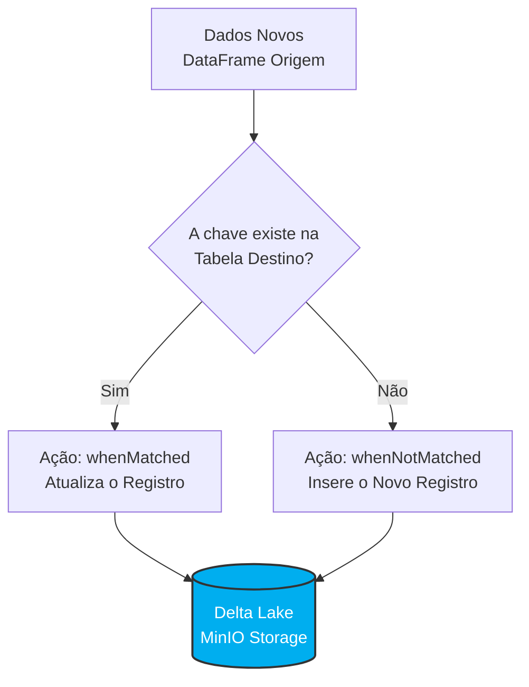

# 03 - Manipulação Transacional (DML) no Delta Lake

Historicamente, repositórios de dados como o Hadoop ou o Amazon S3 eram imutáveis ou *append-only* (apenas inserção). Atualizar ou deletar uma linha específica exigia a reescrita completa de arquivos gigantescos. 

Nesta etapa, demonstramos o poder do paradigma **Lakehouse**: a capacidade de executar operações DML (Data Manipulation Language) granulares e com garantias ACID diretamente sobre os arquivos no bucket `bronze`, sem a necessidade de um banco de dados relacional intermediário.

---

## Inserção e Atualização com MERGE (Upsert)

A operação de `MERGE` é fundamental para pipelines modernos de engenharia de dados. Ela permite cruzar um DataFrame de origem (novos dados) com a Tabela Delta de destino, executando atualizações ou inserções com base em uma condição de correspondência (Match).

### Lógica de Execução do MERGE

O diagrama abaixo ilustra o comportamento de avaliação registro a registro durante a transação:



!!! success "Garantia de Idempotência"
    No exemplo abaixo, utilizamos o `MERGE` para inserir novos fornecedores/credores no sistema de despesas públicas. Se o pipeline for executado múltiplas vezes por acidente, a condição `dst.id_credor = src.id_credor` garantirá que os credores existentes não sejam duplicados, mantendo a integridade da base.

**Script de Merge (Apenas Inserção):**
```python
from delta.tables import DeltaTable

# Conecta na tabela física gerenciada no MinIO
dt_credor = DeltaTable.forPath(spark, bronze('credor'))

(
    dt_credor.alias('dst')
    .merge(
        source = novos.alias('src'), 
        condition = 'dst.id_credor = src.id_credor'
    )
    .whenNotMatchedInsertAll()
    .execute()
)
```

---

## Atualização de Dados (UPDATE)

O Delta Lake permite atualizar valores em massa utilizando a API Python de forma muito semelhante a uma instrução SQL `UPDATE ... SET ... WHERE`. 

No cenário abaixo, estamos normalizando os dados cadastrais, anexando o sufixo "- Capital" aos municípios dos credores localizados no estado de São Paulo.

**Script de Atualização:**
```python
import pyspark.sql.functions as F

dt_credor = DeltaTable.forPath(spark, bronze('credor'))

dt_credor.update(
    condition = F.col('uf') == 'SP',
    set = {
        'municipio': F.concat(F.col('municipio'), F.lit(' - Capital'))
    }
)
```

---

## Exclusão de Registros (DELETE)

A exclusão transacional remove registros que atendem a um critério específico. No contexto governamental, podemos utilizar essa funcionalidade para expurgar registros de pagamentos com status 'Cancelado' das tabelas ativas de relatórios.

!!! warning "Delete Lógico vs. Físico"
    A execução do método `.delete()` altera imediatamente o estado da tabela para quem a consulta, mas não exclui os arquivos subjacentes (`.parquet`) do MinIO instantaneamente. O Delta Lake marca os arquivos antigos como obsoletos e cria novos arquivos sem os registros deletados. Isso é o que permite a funcionalidade de *Time Travel*. Para recuperar o espaço em disco de fato, é necessário executar o comando `VACUUM` posteriormente.

**Script de Exclusão:**
```python
dt_pagamento = DeltaTable.forPath(spark, bronze('pagamento'))

# Exclusão condicional direta no Data Lake
dt_pagamento.delete(condition = F.col('situacao') == 'Cancelado')
```
